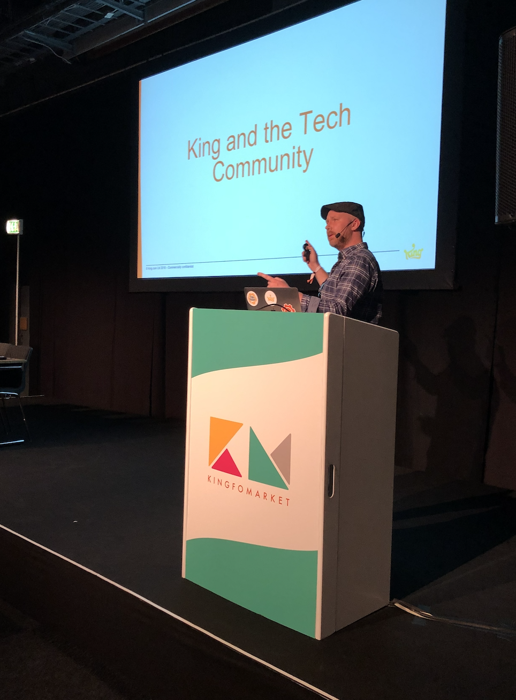

# About Me

{ .float-left width="300" }

I’m **James Glass, PhD**, a Senior Technical Writer and Developer Relations/Documentation Manager with over a decade of experience helping teams and organizations communicate complex ideas with clarity.  

My work is centered around three pillars:  

- **Technical Writing & Docs-as-Code** – Creating clear, developer-friendly documentation using modern, automated workflows.  
- **Developer Relations & Enablement** – Building bridges between engineering teams and developer communities through content, advocacy, and collaboration.  
- **Knowledge Management & Strategy** – Designing scalable approaches to documentation and content that empower teams and support long-term growth.  

---

## What Drives Me

I’m passionate about **simplifying complexity**. Whether it’s translating intricate technical details into accessible documentation or enabling developers to succeed through knowledge sharing, my focus is always on clarity and impact.  

I also have a growing interest in **artificial intelligence and AI agents** — particularly how they can enhance documentation, developer workflows, and knowledge management. I enjoy exploring ways that intelligent systems can support writers, improve content discoverability, and make technical information more interactive and accessible.  

---

## Beyond Work

{ width="350" }  

Outside of work, I find balance and inspiration through creative and active pursuits:  

- 📸 **Photography** – capturing moments and exploring visual storytelling.  
- 🥾 **Hiking** – enjoying nature and disconnecting from screens.  
- 🎬 **Movies** – from thought-provoking documentaries to imaginative cinema.  

I’m also fascinated by the intersection of **technology, media, and human behavior**, and how innovations like AI are reshaping the way we create, consume, and share information.  
