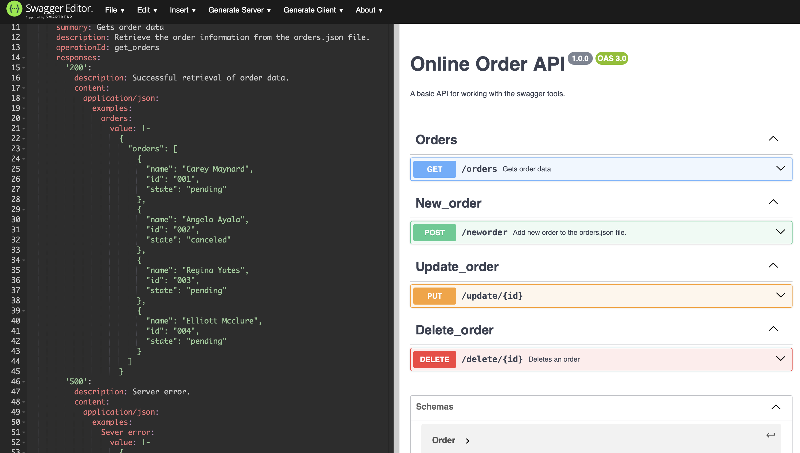

# 🛒 Online Order API

[](LICENSE)


A simple CRUD API built using **Node.js**, **Express**, and documented with **Swagger / OpenAPI 3.0**.  
This project demonstrates designing an API specification *first* with Swagger, then implementing the backend server that follows it.

---



## 📘 Project Overview

This API allows you to:

- Retrieve all orders (`GET /orders`)
- Add a new order (`POST /neworder`)
- Update an order’s status (`PUT /update/{id}`)
- Delete an order (`DELETE /delete/{id}`)

Data is stored in a simple JSON file (`orders.json`), making it easy to understand without needing a database.

---

## 📑 OpenAPI Specification

A full OpenAPI 3.0 specification is available here:

➡️ **[openapi.yaml](openapi.yaml)**

---

## 🚀 Features

- Node.js + Express backend  
- Full OpenAPI/Swagger specification (`openapi.yaml`)  
- CRUD operations on order data  
- Example request bodies and responses  
- Tested with `curl` commands  
- Hosted on GitHub as an example project  

---

## 🧰 Tech Stack

- **Node.js**
- **Express.js**
- **Swagger / OpenAPI 3.0**
- **JSON file-based storage**

---

## 📡 API Endpoints

| Method | Endpoint        | Description             |
|--------|-----------------|-------------------------|
| GET    | `/orders`       | Get all orders          |
| POST   | `/neworder`     | Create a new order      |
| PUT    | `/update/{id}`  | Update an order’s state |
| DELETE | `/delete/{id}`  | Delete an order by ID   |

---

## 🧪 cURL Examples

### GET all orders
```bash
curl http://localhost:3000/orders

### Create a New Order (POST /neworder)
curl --header "Content-Type: application/json" \
     -d "@new_order.json" \
     http://localhost:3000/neworder

### Update an Order (PUT /update/{id})
curl -X PUT -d complete http://localhost:3000/update/001

### Delete an Order (DELETE /delete/{id})
curl -X DELETE http://localhost:3000/delete/002

## 🧪 Example Code (server.js)
// GET all orders
server.get('/orders', (req, res) => {
  res.json(orderData);
});

// POST new order
server.post('/neworder', express.json(), (req, res) => {
  orderData.orders.push(req.body);
  fs.writeFileSync('orders.json', JSON.stringify(orderData));
  res.send('Success');
});

// PUT update
server.put('/update/:id', express.text({ type: '*/*' }), (req, res) => {
  orderData.orders.forEach(order => {
    if (order.id === req.params.id) {
      order.state = req.body;
    }
  });
  fs.writeFileSync('orders.json', JSON.stringify(orderData));
  res.send('Success');
});

// DELETE order
server.delete('/delete/:id', (req, res) => {
  const updated = orderData.orders.filter(order => order.id !== req.params.id);
  fs.writeFileSync('orders.json', JSON.stringify({ orders: updated }));
  res.send('Success');
});

# Project Structure
├── server.js             # Express server and routes
├── orders.json           # Data store
├── openapi.yaml          # OpenAPI (Swagger) specification
├── new_order.json        # Sample POST body
├── README.md
└── LICENSE


# Summary
This project demonstrates a complete design-first approach to API development using:
 - Swagger Editor
- OpenAPI 3.0
- Express.js
- JSON data storage
It showcases how modern APIs can be designed, documented, and implemented from a formal API contract