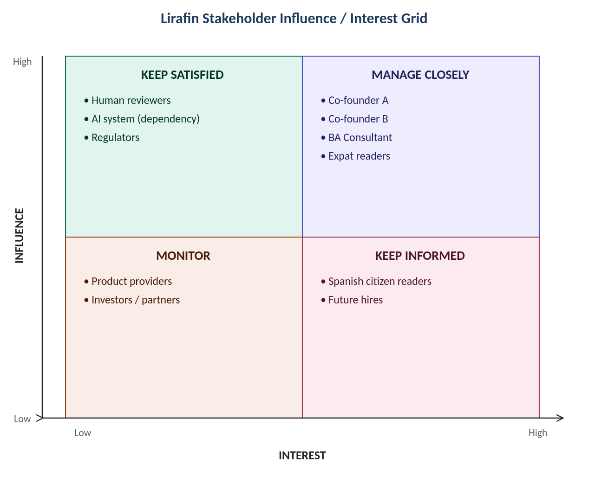

# Stakeholder Analysis

The first phase of the Lirafin engagement: identifying who actually has a stake in the business, and designing engagement around the answer rather than treating "stakeholder management" as a single undifferentiated activity.

## Method

Following BABOK v3's stakeholder analysis approach: identify every stakeholder, score each on influence (their power to affect the business's direction) and interest (how much the outcome matters to them), then design a tailored engagement strategy per quadrant rather than a one-size-fits-all update process.

At a two-person, AI-heavily-automated startup, "stakeholders" turned out to be a mix of people and process roles. The AI system itself is treated as a process dependency in the register below, not a true stakeholder, since it has no interests of its own, but it still needs to be tracked because of how much influence it has over outcomes.

## Stakeholder Register

| Stakeholder | Interests | Concerns | Influence | Interest |
|---|---|---|---|---|
| Co-founder A | Site launched and growing; efficient AI workflows | Losing editorial control to automation; burnout from validation workload | High | High |
| Co-founder B | A structured, well-run business; disciplined delivery | Scope creep; process overhead slowing content output | High | High |
| BA Consultant | Clear mandate; adoption of BA artifacts and processes | Recommendations not implemented; limited access to founders' time | Medium | High |
| Expat readers | Guidance on Spanish systems in accessible language | Inaccurate or outdated info with real financial/legal consequences | Medium | High |
| Spanish citizen readers | Practical local money-saving content | Content feels expat-skewed or too basic | Medium | High |
| Human reviewers | Manageable workload; clear validation standards | Bottleneck if AI output volume outpaces review capacity | High | Medium |
| AI system (process dependency) | Clear prompts, source data, and validation criteria | Hallucinated or stale content reaching publication unchecked | High | N/A |
| Financial product providers | Potential referral relationships | None permitted to influence recommendations, by design | Low (by policy) | Medium |
| Regulators | Data protection and "information not advice" compliance | Site straying into regulated financial advice | High | Low |
| Future hires | Clear onboarding, defined processes | Joining a business with undocumented tribal knowledge | Low (growing) | Medium |

## Influence / Interest Grid

Grouping the register into the standard four quadrants determines how much engagement effort each stakeholder actually needs:

**Manage Closely** stakeholders get weekly check-ins and are treated as the primary requirements source. **Keep Satisfied** stakeholders need processes that meet their needs without constant involvement, this is where the human reviewer's workload and the AI system's prompt quality live. **Keep Informed** stakeholders get regular updates through the site itself or onboarding docs. **Monitor** stakeholders get light-touch tracking, revisited as the business scales.

## What This Surfaced

Mapping the register onto the grid turned a vague sense of "who matters here" into something concrete, and it surfaced a governance gap that had been sitting unaddressed: the company's independence policy, which prevents financial product providers from influencing content or recommendations, existed only as an internal norm. It had never been written down as an explicit, public-facing rule. That's a small finding on paper and a real one in practice: an unwritten policy is much easier to accidentally compromise than a written one.

---

Next: [Process Modeling](process-modeling.md), how the stakeholder map translated into an actual swimlane diagram and process specification.
