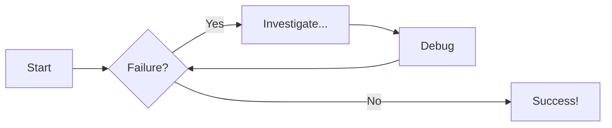
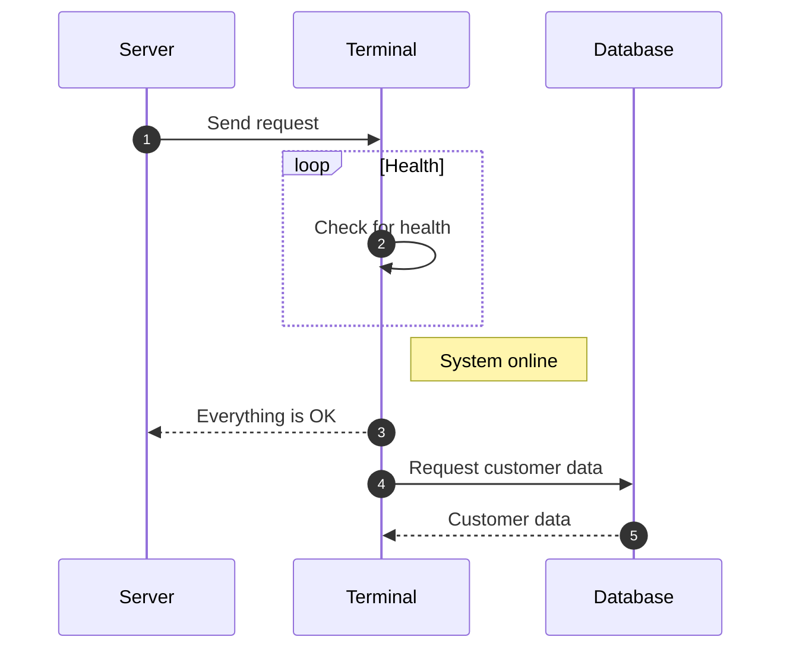
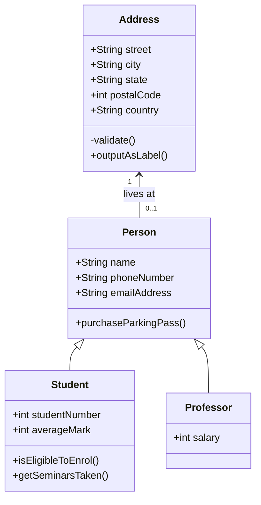

!!! note ""

    **Examples only** 

When prose alone cannot efficiently convey system relationships, process flows, or architectural dependencies, diagrams become an essential documentation tool. The examples in this section illustrate how visual communication can be used to surface complexity, support onboarding, and improve comprehension across technical and non-technical audiences alike. Each diagram was designed with a specific communicative goal in mind — clarity of structure over visual embellishment.

## Flowcharts

## Sequence Diagrams

## Using Class Diagrams

!!! note ""

    **Examples only** 

When prose alone cannot efficiently convey system relationships, process flows, or architectural dependencies, diagrams become an essential documentation tool. The examples in this section illustrate how visual communication can be used to surface complexity, support onboarding, and improve comprehension across technical and non-technical audiences alike. Each diagram was designed with a specific communicative goal in mind — clarity of structure over visual embellishment.

## Flowcharts

## Sequence Diagrams

## Using Class Diagrams
