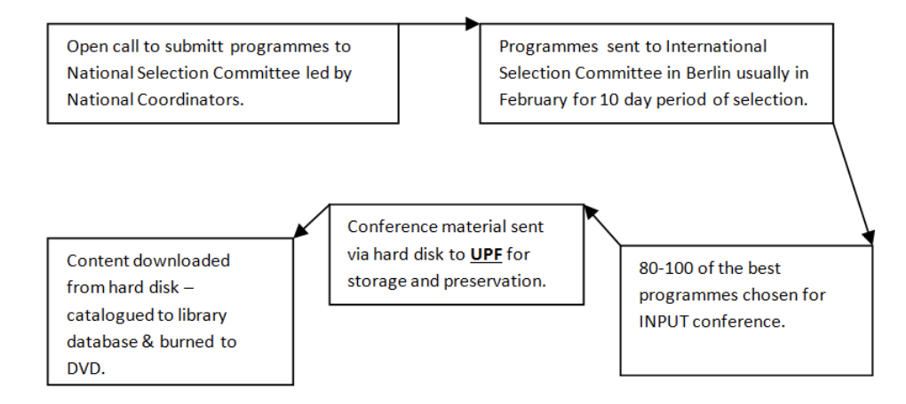

**Master’s Social Communications – Universitat Pompeu Fabra**

!!! note ""

    **Extract**

### Title of Study

**A thematic analysis of the INPUT database and its relationship to Public Service television: Innovation and Quality.** 

**Author:** James Glass  
**University:** Universitat Pompeu Fabra  
**Supervisor:** Dr. Manel Jiménez Morales  

**Abstract**  
This study will highlight and examine the INPUT database at Universitat Pompeu Fabra (UPF). Through a discourse of the construction, history, and uses of the INPUT database by qualitative & thematic analysis methods, this study reveals the construction and value of the database at UPF with a structured interview with key library personnel as a complementary method. INPUT is an annual conference that selects material based on innovation and quality within the public service television sphere. It has become a vital source of information for academia at the university and an important part of modern record keeping from a historical and cultural viewpoint.  

**Keywords:**  
- INPUT database  
- Value  
- Qualitative  
- Thematic analysis  
- Public service television  

---

With the digital era effectively part of our daily lives, databases are vast and accessible at the touch of a button. Historically, libraries have played key roles in information-oriented societies. According to Byamugisha (2009), the physical media that store the recorded knowledge are *“constantly undergoing metamorphosis due to continuous technological advancements and innovations”* (p. 42).  

Thus, digitization of library resource materials opens up new modes of use, enables a much wider potential audience, and gives renewed means of viewing our cultural heritage with a higher degree of clarity and in a much more compact manner.  

This research article begins with a background review and definition of the INPUT database at UPF, then later explores the knowledge of the INPUT database to achieve an understanding of its construction in terms of preserving content history. This is followed by a qualitative approach using a thematic analysis of the UPF database with interviews.  

Therefore, this part of the study will analyze the data from the structured interviews in order to explore and answer the following:  
- To explore the organization and structure of the INPUT database at UPF plus the characteristics of the storage.  
- To develop an understanding of the factors that influence public service television and expectations of key informants as to future developments within digitization according to the INPUT selection and the UPF design of archive categories.  

---

## INPUT – Universitat Pompeu Fabra  

The INPUT database archive at Universitat Pompeu Fabra (UPF) was created in 1994 as a result of an agreement between UPF and INPUT, signed on 20 May 1994. It is formed by the collection of television programmes presented at the annual conferences. These programmes are selected for their innovative yet topic-oriented value and quality.  

The INPUT database is aimed primarily at community television professionals and academics; however, the content is open to anyone to view. The database at UPF holds information about the content of the INPUT conferences held in various countries around the world since 1994. Catalogues, usually known as the *“Bible INPUT”* (L'Arxiu INPUT 2015), are sent to the UPF library along with the programmes, normally on hard drives, to be catalogued and burned to DVD format.  

Figure 1: Source Author – Basic INPUT process flow to the UPF database.

{ width="700" }

*© James Glass 2025*

The core value of INPUT conferences is seen more in the conversations and the debates of the programmes being viewed (INPUT 2011, p. 10).  

As suggested by Miquel de Moragas and Emili Prado (as cited in Larrègola 2015) in *Public Television in the Digital Era (La televisió pública a l’era digital)*:

> “There are two possible concepts of public television. According to one, it plays a subsidiary role in the broadcasting system, supplying the programs that private television doesn’t make because they interest too few people or are too expensive. According to the other, it has a leading role in the broadcasting system, with programming for the general public, guaranteeing it an extensive penetration share that allows it to meet a broad range of public-service targets.” (p. 38)  

Within the database at UPF, the record keeping of television is a process of active decision-making and intervention. Larrègola (2015) further suggests that INPUT usually opts for the first option in terms of documentaries and educational programs, playing a subsidiary role within the public service system.  

Koehler (1999) argues:  

> “Efforts to organize, categorize, index, or catalogue the Web all contain one inherent and fatal flaw... To successfully organize Web content, we must recognize and compensate for the dynamic nature of the Web.” (p. 5)  

Preservation of digital materials reflects active decision-making. As the volume of information in digital form continues to expand rapidly, the issue of what should be preserved will surely require ongoing intervention (Lavoie & Dempsey 2004).  

---

## Organization & Construction of UPF Database  

The database at the UPF library within the Poble Nou campus has over 2,500 programmes from the INPUT conferences, ranging in genre and content. The collection of programmes is complete from 1994, though earlier conferences have not been fully added to the website.  

This database supports education and participation in cultural and creative issues via television programmes stored physically. *“Cultural and individual memory are constantly produced through, and mediated by, the technologies of memory”* (Sturken, 2008, p. 75).  

Programmes are indexed and contextualized through the UPF catalogue system (*Catàleg*), allowing searches by keyword, title, author, and subject.  

The UPF uses **Dublin Core metadata** for documents in its e-repository but has yet to bring the INPUT database up to standards such as those used by the Library of Congress.  

The **International Standard Bibliographic Description (ISBD)** system is utilized at UPF for the description of INPUT materials. ISBD aims to provide a compatible, descriptive cataloguing system worldwide, covering cartographic resources, electronic resources, moving images, multimedia resources, notated music resources, printed texts, sound recordings, and still images (ISBD 2010).  

---

## Uses of the Archive at UPF  

When reflecting on the digitization and preservation of audiovisual collections, careful attention should be paid to accessibility. The INPUT database archive at UPF has been primarily utilized by academia and professionals wishing to see specific programmes.  

“Accessing the archives makes it possible to redraw and reinterpret this history based on each person’s interests, without forgetting that quality television is probably in everybody’s interest.” (Larrègola, 2015, p. 43)  

Byamugisha (2009) states that digital libraries and databases are essential in developing the *“accessibility of knowledge and experience”*, as they assist human development by providing *“a viable system for distributing educated informational topics through the medium of online television viewing”* (p. 46).  

---

## Defining the UPF Database  

INPUT is renowned for the quality of its selection, mainly due to the high standards of varying documentaries that are submitted and chosen for their merits.  

Jenkins (2006) describes *“media convergence”* as the flow of media content across multiple technologies. INPUT challenges norms of broadcasting and raises the standards of quality programming across different countries and systems.  

Larrègola (2015) argues:  

> “The appearance of a trend towards the progressive transfer of points of information to infotainment has to be interpreted as a sign of modernization of information when the growth of infotainment is due to genres.” (p. 40)  

---

*© James Glass 2025*  
