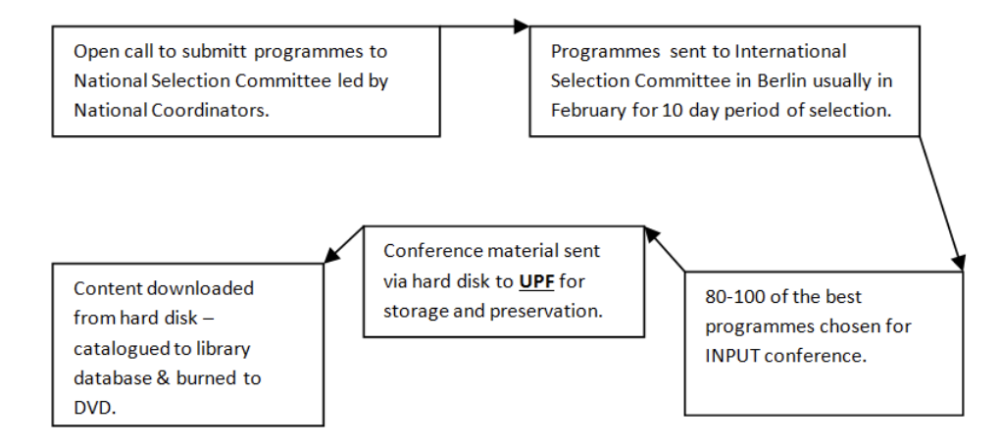

!!! note ""

    **Extract** From **Master’s Social Communications – Universitat Pompeu Fabra**

### Title of Study

**A thematic analysis of the INPUT database and its relationship to Public Service television: Innovation and Quality.** 

**Author:** James Glass  
**University:** Universitat Pompeu Fabra  
**Supervisor:** Dr. Manel Jiménez Morales  

**Abstract**  
This study will highlight and examine the INPUT database at Universitat Pompeu Fabra (UPF). Through a discourse of the construction, history, and uses of the INPUT database by qualitative & thematic analysis methods, this study reveals the construction and value of the database at UPF with a structured interview with key library personnel as a complementary method. INPUT is an annual conference that selects material based on innovation and quality within the public service television sphere. It has become a vital source of information for academia at the university and an important part of modern record keeping from a historical and cultural viewpoint.  

**Keywords:**  
- INPUT database  
- Value  
- Qualitative  
- Thematic analysis  
- Public service television  

---

With the digital era effectively part of our daily lives, databases are vast and accessible at the touch of a button. Historically, libraries have played key roles in information-oriented societies. According to Byamugisha (2009), the physical media that store the recorded knowledge are *“constantly undergoing metamorphosis due to continuous technological advancements and innovations”* (p. 42).  

Thus, digitization of library resource materials opens up new modes of use, enables a much wider potential audience, and gives renewed means of viewing our cultural heritage with a higher degree of clarity and in a much more compact manner.  

This research article begins with a background review and definition of the INPUT database at UPF, then later explores the knowledge of the INPUT database to achieve an understanding of its construction in terms of preserving content history. This is followed by a qualitative approach using a thematic analysis of the UPF database with interviews.  

Therefore, this part of the study will analyze the data from the structured interviews in order to explore and answer the following:  
- To explore the organization and structure of the INPUT database at UPF plus the characteristics of the storage.  
- To develop an understanding of the factors that influence public service television and expectations of key informants as to future developments within digitization according to the INPUT selection and the UPF design of archive categories.  

---

## INPUT – Universitat Pompeu Fabra  

The INPUT database archive at Universitat Pompeu Fabra (UPF) was created in 1994 as a result of an agreement between UPF and INPUT, signed on 20 May 1994. It is formed by the collection of television programmes presented at the annual conferences. These programmes are selected for their innovative yet topic-oriented value and quality.  

The INPUT database is aimed primarily at community television professionals and academics; however, the content is open to anyone to view. The database at UPF holds information about the content of the INPUT conferences held in various countries around the world since 1994. Catalogues, usually known as the *“Bible INPUT”* (L'Arxiu INPUT 2015), are sent to the UPF library along with the programmes, normally on hard drives, to be catalogued and burned to DVD format.  

Figure 1: Source Author – Basic INPUT process flow to the UPF database.

{ width="700" }

*© James Glass 2025*

The core value of INPUT conferences is seen more in the conversations and the debates of the programmes being viewed (INPUT 2011, p. 10).  

As suggested by Miquel de Moragas and Emili Prado (as cited in Larrègola 2015) in *Public Television in the Digital Era (La televisió pública a l’era digital)*:

> “There are two possible concepts of public television. According to one, it plays a subsidiary role in the broadcasting system, supplying the programs that private television doesn’t make because they interest too few people or are too expensive. According to the other, it has a leading role in the broadcasting system, with programming for the general public, guaranteeing it an extensive penetration share that allows it to meet a broad range of public-service targets.” (p. 38)  

Within the database at UPF, the record keeping of television is a process of active decision-making and intervention. Larrègola (2015) further suggests that INPUT usually opts for the first option in terms of documentaries and educational programs, playing a subsidiary role within the public service system.  

Koehler (1999) argues:  

> “Efforts to organize, categorize, index, or catalogue the Web all contain one inherent and fatal flaw... To successfully organize Web content, we must recognize and compensate for the dynamic nature of the Web.” (p. 5)  

Preservation of digital materials reflects active decision-making. As the volume of information in digital form continues to expand rapidly, the issue of what should be preserved will surely require ongoing intervention (Lavoie & Dempsey 2004).  

---

## Organization & Construction of UPF Database  

The database at the UPF library within the Poble Nou campus has over 2,500 programmes from the INPUT conferences, ranging in genre and content. The collection of programmes is complete from 1994, though earlier conferences have not been fully added to the website.  

This database supports education and participation in cultural and creative issues via television programmes stored physically. *“Cultural and individual memory are constantly produced through, and mediated by, the technologies of memory”* (Sturken, 2008, p. 75).  

Programmes are indexed and contextualized through the UPF catalogue system (*Catàleg*), allowing searches by keyword, title, author, and subject.  

The UPF uses **Dublin Core metadata** for documents in its e-repository but has yet to bring the INPUT database up to standards such as those used by the Library of Congress.  

The **International Standard Bibliographic Description (ISBD)** system is utilized at UPF for the description of INPUT materials. ISBD aims to provide a compatible, descriptive cataloguing system worldwide, covering cartographic resources, electronic resources, moving images, multimedia resources, notated music resources, printed texts, sound recordings, and still images (ISBD 2010).  

---

## Uses of the Archive at UPF  

When reflecting on the digitization and preservation of audiovisual collections, careful attention should be paid to accessibility. The INPUT database archive at UPF has been primarily utilized by academia and professionals wishing to see specific programmes.  

“Accessing the archives makes it possible to redraw and reinterpret this history based on each person’s interests, without forgetting that quality television is probably in everybody’s interest.” (Larrègola, 2015, p. 43)  

Byamugisha (2009) states that digital libraries and databases are essential in developing the *“accessibility of knowledge and experience”*, as they assist human development by providing *“a viable system for distributing educated informational topics through the medium of online television viewing”* (p. 46).  

---

## Defining the UPF Database  

INPUT is renowned for the quality of its selection, mainly due to the high standards of varying documentaries that are submitted and chosen for their merits.  

Jenkins (2006) describes *“media convergence”* as the flow of media content across multiple technologies. INPUT challenges norms of broadcasting and raises the standards of quality programming across different countries and systems.  

Larrègola (2015) argues:  

> “The appearance of a trend towards the progressive transfer of points of information to infotainment has to be interpreted as a sign of modernization of information when the growth of infotainment is due to genres.” (p. 40)  

---

*© James Glass 2025*  

### Title of Study

**The reality of “Google glass” versus the “Black Mirror” TV show: eye implant technology** 

**Author:** James Glass  
**University:** Universitat Pompeu Fabra  
**Supervisor:** Dr. Manel Jiménez Morales  

**Abstract**  
This study examines the technology of “Google Glass”, an Optimal Head Mounted Display (OHMD), versus the suggested technology in the British television series: Black Mirror, season 1, Episode 3 - The entire history of you about an eye implantation device that is enables the user to view, record and playback everything that is seen through their eyes. Through a content analysis approach of academic articles and informational sources, this study will compare and contrast the applications of the “real” and “fictional” aspects of this technology and how it has impacted humanity in terms of human ability being replaced by technology. The study will also highlight any potential human impact factors along potential advantages and disadvantages of using the technology within a society and culture that is trying to keep up with technology advancements. Over the last 100 years human society and culture in conjunction with technology advancements beginning from the invention of Morse code to radio through to the television and internet achievements. There have been incremental steps in our society´s culture growth based on technologies.
 
Keywords: Google Glass, OHMD, Black Mirror, eye implantation, real, fictional, society, technology advancements.

## **Introduction**
The episode of “Black Mirror The entire history of you” originally aired in the UK in 2011 and a winner of an International Emmy in 2012 for Best TV Mini-Series, the drama series explores the dark side of modern technology and how technology has impacted humanity in many ways. We as human beings and a society have had incremental steps during the invention and development of technology. The television show of Black Mirror provides us with some tantalizing concepts about our humanity, relationships with each other and our reliance on technology for everyday life.  The episode pushes the idea of how man and technology have merged in many ways, having this interweaving relationship of control and necessity within the episode. The reality is that the technology is here in the form of “Google Glass” however it was not just invented overnight the components of Google Glass have been developed over the last 15 years from other technologies and were brought together to form the “Glass”. If we conceive that “new technologies were not ‘inventions’ that came from nowhere . . . new technologies were constructed from existing ones” (Basalla, 1998, p. 2).

Mankind has had an important and fundamental relationship with invention and its environment. “Technology tends to become mythic; that is, perceived as part of the natural order of things, and therefore tends to control more of our lives than is good for us.” (Postman, 2015 p. 8). “The fact is worth remembering because it is often neglected that the words animal and environment make an inseparable pair. Each term implies the other. No animal could exist without an environment surrounding it. Equally, although not so obvious, an environment implies an animal (or at least an organism) to be surrounded. This means that the surface of the earth, millions of years ago before life developed on it, was not an environment, properly speaking” Gibson (1979, p. 8). Over the last 100 years, we have seen an unprecedented evolutional change with technology and its effects on our societies and cultures. 

If we look at cybernetics, according to Weiner (1948) “control and communication” can define cybernetics yet there is a real comparison to the human nervous system with cybernetics, overall. Hence his writing is comprised of complex terminology of both physiological and mathematical logic intertwined with a sort of personal log that was published on the subject of cybernetics. The basic mathematical concepts, calculations and technological applications by computers and to track airplanes, for anti-aircraft guns, by the military and other such technologies were stepping stones in the developmental process of cybernetics. The act of communication and logic within these processes would help establish theorems by scientists plus the comparisons to the human nervous system that have been integrated throughout the conception of cybernetics as a field of study. The Journal of Philosophy (1949) suggests that Dr. Wiener could have expanded on the physiological mechanisms and also the underlying the recognition of structural patterns hence takes a negative stance against the author. Furthermore as suggested by the Journal of Philosophy (1949) on Weiner´s work, as to the “genesis” of cybernetics, the “statistical mechanics” of the process of various types pulsations involved in “signaling or communication”, (p. 737). Cybernetics, as a technology, along with the cultural influence has been a fascinating and a plausible concept since the 1940´s and will be of continual interest.

If we contemplate the historical relationships between radio, newspapers and television as forms of technology within the early period of their use, they were all delicate and complicated. There was a difference in what people could read within newspaper form as to what they could see in a visual form, in that, it could be visually deceiving, due to editing and camera perspective. In addition to the distorted perspective of these forms meant society had gotten used to the ease of seeing news, programmed TV shows and the capitalists saw this as an opportunity to invest in the commercial side of television, buy advert time during popular peak time viewing.  Furthermore, “Capitalists are by definition not only personal risk takers but, more to the point, cultural risk takers” (Postman, 2015 p. 6). This was more common in America as compared to Britain, which only had the BBC to provide the first of the nation’s programs, through radio and then television, though later with independent channels, commercialism did occur.  The intervals between popular television shows were obvious places for the advertising due to which there was a cause and effect justification for this, in that, money was to be made from buying airtime. Society benefited from such adverts and it all relates to the consumerism machine, which in fact has not changed much since the early 1950´s. It is an apparently sophisticated technological determinism which has the significant effect of indicating a social and cultural determinism: a determinism, which justifies the societal consent of allowing this to occur.

## **Black Mirror**
In the episode of Black Mirror, “The entire history of you”, season 1, episode 3, the human characters are in a natural environment yet are dependent on the eye implant technology for their way of life, recording and replaying aspects of their lives.  The episode revolves around infidelity, sex and emotions joined with this implant technology that is able to record aspects of life, to be replayed over and over again.  

According to Postman (2015 p. 2) in an online article posed some questions “What will a new technology do?” is perhaps equal to the question "What will a new technology undo? This rethinking of what technology can undo rather than do, relates to the episode of Black Mirror in many ways as technology sometimes can take away the human factor to humanity and our senses.  Furthermore, suggested by Postman (2015 p. 5) when the printing press was invented, in the 1500’s in Europe, it was not Europe and the printing press, it became a new Europe. Also when the television was invented and became wide spread in America, for example, it was not America and the television, society changed, the way we interacted at home changed. In summary, when a new technology is introduced it does not change one aspect of life, it changes everything. Society in many ways pays the price for a new technology. Further suggested by Postman (2015, p. 4) “technological change is ecological change”.

Technology has been and cause and effect of mankind’s endeavor’s to adjust and adapt to the social changes and demands throughout history.  Only through the internal quest of being human and moving forward has the development of technology occurred. The writer, Raymond Williams “Television - Technology and Cultural form” wrote his book at an era of when old technologies, such as video cassette and video were products just being tested on the market and cable television was at its beginnings. The book was written from a historical viewpoint of how technological invention began with radio along with its scientific periods, its relationship with society, politics and the human condition developed through new forms of media such as television. As the author describes “mechanical and electric transport, or in telegraphy, photography, motion pictures, radio and television, were at once incentives and responses within a phase of general social transformation” (Williams. 1990 p. 11).  Furthermore according to a reviewer in the “biological application of cybernetics: there is a close analogy between the nervous system and the single run of a computing machine, not merely because the active-refractory operation of the neuron and the synaptic contacts parallel the series of binary choices employed in the most efficient computer, but because analogues of memory and learning can be built into the machine; the analogy suggests a fruitful non-materialist approach to the psychopathology of functional disorders of the brain.” The episode transmits technology as part of humanity, part of our senses.  According to Postman Technology giveth and technology taketh away. This means that for every advantage a new technology offers, there is always a corresponding disadvantage. The disadvantage may exceed in importance the advantage, or the advantage may well be worth the cost. 

## **Google Glass**
According to Jeroudi et al., (2014) Google Glass is a modern device with optical head mounted display technology that is designed to function in a hands free smartphone in many ways, capsulated in an optical mount.  Compared to the Black Mirror theoretical technology, the Google Glass is less intrusive though as a reality of our modern world it has applications not just for recreation but within the medical world as well, through surgeries, lifesaving first aid via the Glass.  The Black Mirror episode that uses the technology of the eye implant which is embedded chip located at the base of the skull that enables the user to record and replay events the reality of our modern world with as parallels with the Google Glass technology.

Furthermore, according to Sergey Brin, the cofounder of Google, during a recorded Ted Talks, “In contrast to a Smartphone, Google Glass allows people to keep their head up as digital onto their world, no matter where their gaze point is, information is overlaid” (Tedtalks.com).  Technology has been integrated into our world as much as humanity has been integrated into it. Google Glass has many applications in the real world, from recording your wedding day to a fun day out moreover it has been pioneered not only in recreational use but in the medical industry, in surgeries and pharmaceutical use “Okay, Glass, take a picture,” Galdo and Bryant (2014) - produces an image that can be used for medication safety and error records. Overall technology, within today’s societies, is an integral part of our culture and way of life. “Technological change is not additive; it is ecological, which means, it changes everything and is, therefore, too important to be left entirely in the hands of Bill Gates.”  (Postman, 2015 p. 8)

## **References**
Basalla, G. (1998) “The Evolution of Technology”, Cambridge University Press 1988, The Edinburgh Building 
Cambridge CB2 2RU, UK.
Black Mirror - Retrieved 19th January 2015 from http://www.slate.com/art icles/arts   /culturebox /201 3712/black_mirror_on _directv_british_drama_about_technology_and_ its_dangers.html. Black Mirror – “The 
entire history of you” Retrieved 20 January 2015, from https://www.youtube.com/  watch?  
v=is9h6HbdXdo&spfreload=10
Galdo, J. PharmD, BCPS, CGP. Bryant, B.S. RPh (2014) Google Glass: “Seeing is believing” DRUG TOPICS , P. 52, April 
2014, Copyright Advanstar Communications, Inc. Apr 2014
Gibson, J.J. (1979). The Ecological Approach to Visual Perception. Boston: Houghton Mifflin 
Gibson, J.J. (1966). The Senses Considered as Perceptual Systems. Boston : Houghton Mifflin. 
Jeroudi, O. M.  MDa,b ,  Christakopoulos, G. MDa,b, Christopoulos, G. MDa,b , Kotsia, A. MDa,b, 
Kypreos, M A. BSc.  Rangan, B.V. BDS, MPHa,b,  Banerjee, S. MDa,b, and Brilakis,E.S, MD, PhDa,b, (2014) “Accuracy of Remote Electrocardiogram Interpretation Withthe Use of Google Glass Technology”. Published by ElsevierInc.http://dx.doi.org/10.1016/j.  amjcard.2014.11.008 
Johnson, Harry G. (1949): “Cybernetics: Control and Communication in the Animal and the Machine by Norbert Wiener” The Economic Journal
Manovich, L. (2007) “Lev Manovich and The Language of New Media” Published by The Centre 
for Internet Research, Aarhus, June 2007. Rune Dalgaard (ed.)University of Aarhus, Denmark
Postman, N, “Five things you need to know about technological change”Retrieved 31st January 2015, from https://www.student.cs.uwaterloo.ca/ ~cs492/papers /neil-postman--five-things.html 
Nye, B. D. & Silverman, B. G. (2012). Affordance. In N. M. Seel (Ed.),Encyclopedia of the 
Sciences of Learning (pp. 179-183).  New York, NY: Springer. doi: 10.1007/978-1-4419-1428-6_369 The final publication is available at www.springerlink.
Brin , S. - Retrieved 30th January 2015 from http://www.ted.com/talks/sergey_brin_ why_google_glass 
Singh G (2014) Recognition and the image of mastery as themes in Black Mirror (Channel 4, 
2011–present): an eco-Jungian approach to 'always-on' culture, International Journal of Jungian Studies, 6 (2), pp. 120-132.
Wiener, N. (1949). Cybernetics: Control and Communication in the Animal and the Machine. 
(Review by: Harry G. Johnson) The Economic Journal, Vol. 59, No. 236 (Dec., 1949), pp. 573-575. Retrieved 1 February 201, from http://www.fotopublica.net/MUCS/ 4_Johnson _Harry_Wiener_ Cybernetics_1949.pdf
Weiner, N. (1949). Or Control and Communication in the Animal and the Machine (Review by: E. N. )The Journal of 
Philosophy, Vol. 46, No. 22 (Oct. 27, 1949), pp. 736-737 Published by: Journal of Philosophy, Inc. Stable URL: http://www.jstor.org/ stable/2020260 
Weiner, N. (1948) “Cybernetics or control and communication in the animal and the machine” The Technology 
Press. John Wiley  Sons, Inc., New York, Hermann et CIE, Paris. Retrieved 9 February 2015, from http://www.fotopublica.net/MUCS/ Wiener_Cybernetics_Intro_1948.pdf
Williams, R. (1990). Television: Technology and cultural form (Routledge classics Ed.). London: Routledge.
