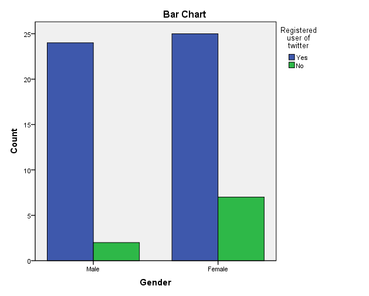
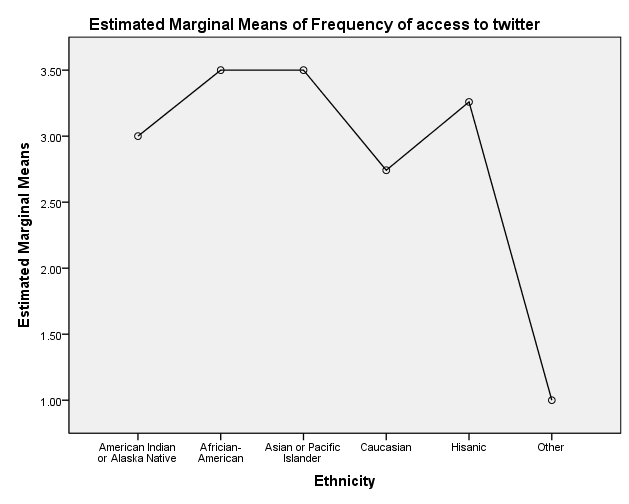
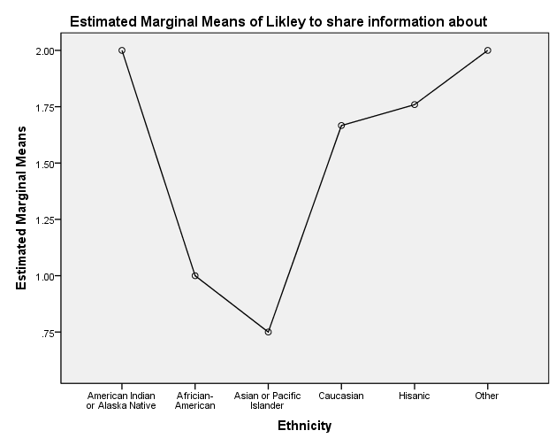
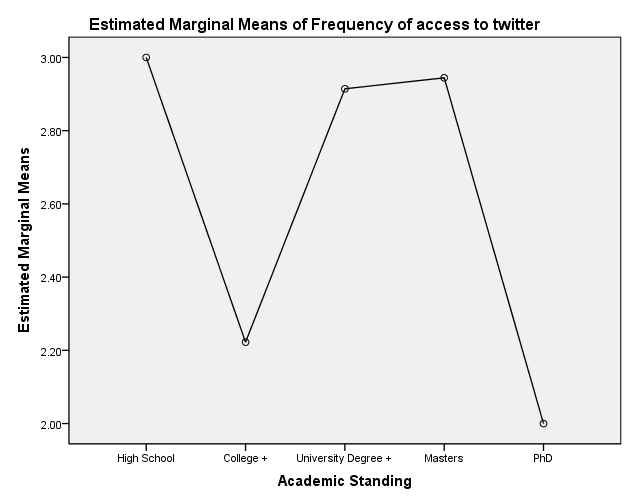
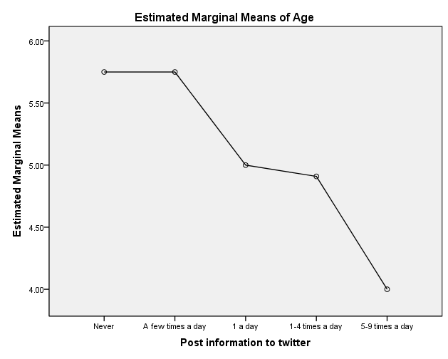

### Title of Study

**The Relationship Between Demographics and Twitter Usage in the Dissemination of Online Media Content**

- **Author:** James Glass  
- **Institution:** Universitat Pompeu Fabra  
- **Supervisor:** [Prof. Frederic Guerrero Sole](http://aulaglobal2014-2015.upf.edu/user/view.php?id=5294&course=2442)  

**Quantitative Research (2014–2015)**
---

## Abstract
This study examines the relationship between demographics and Twitter usage to determine whether demographic factors influence the dissemination of media content. Using quantitative methodology and a self-administered online survey, the research investigates how age, gender, ethnicity, and academic standing relate to Twitter use and information sharing behaviour. The findings shed light on how mobile technology has enabled citizens to record, publish, and influence social movements — from everyday events to politically significant actions — reaching a global audience in real time.

**Keywords:** race, gender, age, citizen, demographics, social network site, Twitter, dissemination.

---

## Introduction
When we think about our society today with all the modern technology available — from multi-satellite providers to the latest personal home entertainment — that technology has its roots in a complex yet steady cultural form. The relationship between cultural form and society has been developed through technology. We can observe that almost everyone has a modern mobile device capable of recording, editing, and posting online to a social network site, thus having the potential to influence society with its contents. A social network site can be defined as "web-based services that allow individuals to (1) construct a public or semi-public profile within a bounded system, (2) articulate a list of other users with whom they share a connection, and (3) view and traverse their list of connections and those made by others within the system" (Boyd and Ellison, 2008, p. 211). These cycles of invention have helped transform societies, build new communities, new trends, and new ways in which our species interacts within communities and communicates. As another author describes the impact of communication: "mechanical and electric transport, or in telegraphy, photography, motion pictures, radio and television, were at once incentives and responses within a phase of general social transformation" (Williams, 1990, p. 11).

In today's societies we rely on various online social network sites for entertainment, news, or self-gratification. The method of uploading to social network sites such as YouTube or Facebook can be viral in essence — hence the term "go viral" — and as this term suggests, once a video recording is posted and becomes popular, it can spread to every corner of the internet, reaching different places with images or recordings that can be of a profound nature.

According to Ballard (2011), Twitter is one of the newest social media networks to integrate within society and has changed the way people communicate around the world. Twitter is a social network site with micro-blogging capabilities, created by Evan Williams, Jack Dorsey, and Biz Stone. Twitter has become the communication company it is today by combining three existing technologies: a real-time delivery notification system, text messaging, and instant messaging. Twitter allows any of its users to contribute ideas, opinions, interests, and perspectives about life and important societal or political events. As a self-proclaimed "real-time information network", Twitter's mission statement suggests it is "Powered by people all around the world [and] lets them share and discover what's happening now" (Twitter.com). Twitter's mission statement remains parallel with McQuail's (2010) words that "mass media and society are continually interacting and influencing each other" (p. 81).

Another one of Twitter's strengths is that it can be accessed from a computer, netbook, iPad, or mobile communication device. Kwak, Lee, Park, & Moon (2010) analysed how quickly information could spread through sent tweets and the retweet option: "A closer look at retweets reveals that any retweeted tweet is to reach an average of 1,000 users no matter what the number of followers is of the original tweet. Once retweeted, a tweet gets retweeted almost instantly on the 2nd, 3rd, and 4th hops away from the source, signifying fast diffusion of information after the 1st retweet" (p. 600).

The ease of use within the social online media world gives users a space to disseminate information. There are many web platforms used by only 25% of Twitter users, with the other 75% using one of the over 50,000 third-party applications (Brown, 2010). There are millions of photos and videos uploaded and created as a form of personal expression or point of view. "YouTube statistics has more than 1 billion users visit each month and over 6 billion hours of video are watched each month on YouTube" (YouTube Statistics, 2014).

Consumers of mobile phones are now the new generation of journalists, documentarists, and filmmakers — citizens who record and post media content online with a powerful stance in society. "The filmmaker's retirement to the position of observer calls on the viewer to take a more active role in determining the significance of what is being said and done" (Nichols, 2001, p. 111). "Non-fiction filmmaking serves a wide range of purposes that can include entertainment, education, propaganda, and the disclosure of information in a certain way" (Kochberg, 2002, p. 6).

Furthermore, there are self-fulfilment reasons why people post online, along with a global necessity for dissemination of information. An audience-centred perspective assumes "(a) media behavior is purposive, goal-directed and motivated, (b) people select media content to satisfy their needs or desires, (c) social and psychological dispositions mediate that behavior, and (d) the media compete with other forms of communication — such as interpersonal interaction — for selection, attention and use" (Rubin et al., 2003, p. 129). Social network sites have helped facilitate change in many ways. According to Blake (2011), Twitter, Facebook, and YouTube play vital parts within the news machine and are able to provide instant, up-to-date news compared to traditional outlets. "People share information on social networking sites, of which Facebook and Twitter are among the most popular. These sites are very versatile, enabling the sharing of text, pictures, videos, audio files, and applications" (Joseph, 2012, p. 148).

"Streaming, recording, and sending video requires a higher-end handset with video capture and consumes significant bandwidth. Yet, mobile video can also be one of the most effective ways to share important information and current events not covered by conventional media. Individuals can record and send short videos to popular video sharing sites such as YouTube. Videos can also be posted directly to web blogs" (Verclas, 2008, p. 13). Social networks have pioneered the use of social media with mobile phones and created a much-needed online media market. "Not only do social media provide users with a global audience, they are often inexpensive or free to use. Additionally, creating, sharing, and editing content on social media sites is incredibly easy to do and occurs in real time" (Ballard, 2011, p. 21).

A significant example of social media technology was the Arab Spring. Adullatif (2013, p. 1) describes how, following a series of prior demonstrations in other countries within the Arab League, Mohammed Bouazizi — a young Tunisian fruit seller — died in December 2010 from self-inflicted injuries in protest of conditions he lived in. This was one of many examples of unrest throughout Tunisia and later in Egypt and surrounding countries, known as the Arab Spring, that led to mass change in the region. What followed was media-assisted change: a wave of social and political movement organised through sites such as Twitter and Facebook. Protesters used Twitter, Facebook, YouTube, and mobile phone messages to express anger, organise events, and warn others of impending dangers throughout the civil unrest.

According to Ekwo (2012), social media and networking played vital roles during the Arab Spring. There was a relationship between video recordings posted to Twitter and Facebook by ordinary citizens and how these recordings were fed to mainstream traditional media channels in the Middle East. Social media became a vital element in the everyday lives of ordinary people living under dictatorship. Similarly, Lynch (2011) argued that uploading images onto Facebook and Twitter was new and ground-breaking. This way of communicating helped drive change in the region, as instant live news via online platforms contributed to the success of the social movement. "Through blogs, video-sharing and other forms of participatory publishing, citizens have the potential to set the agenda themselves, subverting the traditional model of the press as the primary arbiters of the public agenda" (Antony, 2010, p. 1284).

This study builds on previous studies, developing concepts from an analytical viewpoint. It explores the actions and perceptions of Twitter users who are the modern-day publishers online. The first section consists of a literature review, followed by quantitative research. The next section demonstrates the methods used to obtain the data, from research questions to the survey model. Results are then presented based on criteria set out before the conclusion.

---

## Theoretical Framework
This study is framed primarily through the lens of **Uses and Gratifications Theory**, which positions media users as active participants who select media to fulfil specific needs and goals. Drawing from Ballard (2011), Blumler & Katz (1974), and concepts from McLeod and Becker (1981) and Haridakis and Whitmore (2006), the theory possesses five basic assumptions: users of social media should (1) be active within the online world and (2) have goals when using media; (3) the media should fulfil the user's needs; (4) media selection is pivotal to the user's motives for communication; and (5) the theory signifies media content, exposure to it, and the "context in which the exposure takes place" (Ancu & Cozmo, 2009, p. 569).

This framework is relevant here because it helps explain why people use Twitter — whether to seek information, share opinions, or participate in social movements — and whether those motivations vary by demographic group. The literature reviewed suggests that dissemination of online material depends on the user and social context, as demonstrated by the Arab Spring example discussed above. The extent to which demographics interact with frequency of Twitter use and dissemination behaviour is the central question this study seeks to address.

Gatekeeping is also a relevant concept. It is now shared by journalists and consumers alike, as both entities have effectively become news editors (Doctor, 2010). This shift supports the argument that ordinary citizens — regardless of demographic background — have the potential to influence public discourse through platforms such as Twitter.

The following research questions were derived from this theoretical context:

- What are the most common social network sites being used?
- What are the general demographics of Twitter users?
- How often is Twitter being used, and does frequency vary by demographic?
- What types of information are people likely to share on Twitter?
- Is Twitter used as a primary news source?
- What technology is being used to access social network sites?

From these, the following formal research questions were defined:

***RQ1: Is there a link between gender and age in Twitter usage? (Q1, Q3 & Q10)***

***RQ2: Does the sharing of information online within Twitter depend on ethnicity and academic standing? (Q4 & Q17)***

***RQ3: Can posting information and news content be related to self-gratification? (Q13, Q14 & Q15)***

***RQ4: What is the overall relationship between the demographics surveyed and the type of technology being utilised? (Q1–Q4 & Q16)***

---

## Participants
All participants were acquired randomly to give a varied and wide enough sample. Participants were asked to classify themselves as male or female. The age of the subjects ranged from 18 or less to 30+. Ethnicity and academic standing were also part of the demographic section of the survey.

The majority of the sample was likely to represent the demographic breakdown of Twitter users as a whole. The sample was put online via a social platform due to the easy accessibility of the URL link and the likelihood that this demographic utilises social media.

---

## Research Design — Data Collection
A survey was the appropriate method for this study because it allows for the largest number of participants to take part, given time requirements and low cost. Participants were asked to complete an online, self-administered survey hosted on Typeform. Participation was voluntary and all responses were completely anonymous. There was no cost to participate and no personal information other than demographics was asked.

---

## Measures
The first four questions were set demographically to ascertain general characteristics of the survey:

- **Q1. What is your gender?** Male (1), Female (2)
- **Q2. What is your ethnicity?** American Indian or Alaska Native (0), African-American (1), Asian or Pacific Islander (2), Caucasian (3), Hispanic (4), Other (6)
- **Q3. What is your academic standing?** High School (0), College+ (1), University Degree+ (2), Masters (3), PhD (4)

For questions **Q5–Q8**, *How frequently do you access the following social site?* (YouTube, Facebook, Twitter, Myspace), a 9-point scale was used: 0 = "rarely," 1 = "monthly," 2 = "once a week," 3 = "several times a week," 4 = "once a day," 5 = "2–4 times a day," 6 = "5–8 times a day," 7 = "9–12 times a day," 8 = "more than 12 times a day."

**Q9.** *I'm a registered user of Twitter* — Yes (1), No (2)

**Q10.** *I access my Twitter account:* 0 = "rarely," 1 = "monthly," 2 = "once a week," 3 = "a few times a week," 4 = "once a day," 5 = "2–4 times a day," 6 = "5–8 times a day," 7 = "9–12 times a day," 8 = "more than 12 times a day."

**Q11.** *I'm more likely to follow accounts on Twitter that:* "I don't follow any" (0), "Relate to me" (1), "Know me personally" (2), "Entertain me" (3), "Educate or inform me" (4).

**Q12.** *I use Twitter to obtain news* — strongly disagree (0), disagree (1), neutral (2), agree (3), strongly agree (4).

**Q13.** *I post information online to Twitter (News/media content)* — Never (0), A few times a week (1), 1 a day (2), 1–4 times a day (3), 5–9 times a day (4), 10+ times a day (5).

**Q14.** *I retweet information online to Twitter (News/media content)* — Never (0), 1 a week (1), 1 a day (2), 1–4 times a day (3), 5–9 times a day (4), 10+ times a day (5).

**Q15.** *I use Twitter for the following reasons:* I don't use Twitter (0); to see other people's tweets (1); to search for information (2); to share the tweets of others by retweeting (3); to send tweets to all of my followers (4); to access news stories (5); to share my own opinions and ideas (6); to read other people's profiles and tweets (7); to share my photos, videos, and other interests (8); to stay in touch with people I interact with (9); to access information about film, music, sports, politics, or other interests (10).

**Q16.** *I access Twitter from:* Laptop (0), PC (1), Tablet (2), Mobile Phone (3), A combination of the above (4), I don't access Twitter (5).

**Q17.** *I'm likely to share information:* About my political views and opinions (0), About current news events (1), About my life and interests (2), About an ongoing social problem or movement (3), About my religion (4), About my relationships (5), None of the above (6).

---

## Results

## **RQ1**
**Is There a Link Between Gender and Age Along with Being a Registered Twitter User?**

Using a crosstab table and Chi-Square test, we can determine if there is a relationship between two variables that is **not due to chance**. The independent nominal variables are Gender & Age; the nominal dependent variable is Registered User of Twitter.

#### Case Processing Summary
| | Cases | | | | | |
|---|---|---|---|---|---|---|
| | Valid | | Missing | | Total | |
| | N | Percent | N | Percent | N | Percent |
| Gender * Registered user of Twitter | 58 | 100.0% | 0 | .0% | 58 | 100.0% |
| Age * Registered user of Twitter | 58 | 100.0% | 0 | .0% | 58 | 100.0% |

#### Gender — Registered User of Twitter (Crosstab)
| | | | Registered user of Twitter | | Total |
|---|---|---|---|---|---|
| | | | Yes | No | |
| Gender | Male | Count | 24 | 2 | 26 |
| | | % within Gender | 92.3% | 7.7% | 100.0% |
| | | % within Registered user | 49.0% | 22.2% | 44.8% |
| | | % of Total | 41.4% | 3.4% | 44.8% |
| | Female | Count | 25 | 7 | 32 |
| | | % within Gender | 78.1% | 21.9% | 100.0% |
| | | % within Registered user | 51.0% | 77.8% | 55.2% |
| | | % of Total | 43.1% | 12.1% | 55.2% |
| Total | | Count | 49 | 9 | 58 |
| | | % within Gender | 84.5% | 15.5% | 100.0% |
| | | % of Total | 84.5% | 15.5% | 100.0% |

- Of n=26 males, 24 were registered and 2 were not, representing 44.8% of surveyed participants.
- Of n=32 females, 25 were registered and 7 were not, representing 55.2% of surveyed participants.

#### Chi-Square Test — Gender
| | Value | df | Asymp. Sig. (2-sided) | Exact Sig. (2-sided) | Exact Sig. (1-sided) |
|---|---|---|---|---|---|
| Pearson Chi-Square | 2.201ᵃ | 1 | .138 | | |
| Continuity Correction | 1.252 | 1 | .263 | | |
| Likelihood Ratio | 2.341 | 1 | .126 | | |
| Fisher's Exact Test | | | | .167 | .131 |
| Linear-by-Linear Association | 2.163 | 1 | .141 | | |
| N of Valid Cases | 58 | | | | |

*a. 2 cells (50.0%) have expected count less than 5. The minimum expected count is 4.03.*
*b. Computed only for a 2×2 table.*

**χ(1) = 2.201, p = 0.138** — there is no significant association between gender and being a registered user of Twitter. The number is above 0.051, so the significance is due to chance.

#### Symmetric Measures — Gender
| | | Value | Approx. Sig. |
|---|---|---|---|
| Nominal by Nominal | Phi | .195 | .138 |
| | Cramer's V | .195 | .138 |
| N of Valid Cases | | 58 | |

Chi-Square value is 0.195, AND p = 0.138 is greater than the alpha significance of p = 0.05. There is no statistically significant reason to believe gender is related to being a registered Twitter user.

---

#### Age — Registered User of Twitter (Crosstab)
| | | | Registered user of Twitter | | Total |
|---|---|---|---|---|---|
| | | | Yes | No | |
| Age | 18–19 | Count | 1 | 0 | 1 |
| | | % within Age | 100.0% | .0% | 100.0% |
| | | % within Registered user | 2.0% | .0% | 1.7% |
| | | % of Total | 1.7% | .0% | 1.7% |
| | 20–21 | Count | 3 | 0 | 3 |
| | | % within Age | 100.0% | .0% | 100.0% |
| | | % within Registered user | 6.1% | .0% | 5.2% |
| | | % of Total | 5.2% | .0% | 5.2% |
| | 22–24 | Count | 8 | 1 | 9 |
| | | % within Age | 88.9% | 11.1% | 100.0% |
| | | % within Registered user | 16.3% | 11.1% | 15.5% |
| | | % of Total | 13.8% | 1.7% | 15.5% |
| | 25–29 | Count | 20 | 2 | 22 |
| | | % within Age | 90.9% | 9.1% | 100.0% |
| | | % within Registered user | 40.8% | 22.2% | 37.9% |
| | | % of Total | 34.5% | 3.4% | 37.9% |
| | 30 and over | Count | 17 | 6 | 23 |
| | | % within Age | 73.9% | 26.1% | 100.0% |
| | | % within Registered user | 34.7% | 66.7% | 39.7% |
| | | % of Total | 29.3% | 10.3% | 39.7% |
| Total | | Count | 49 | 9 | 58 |
| | | % within Age | 84.5% | 15.5% | 100.0% |
| | | % of Total | 84.5% | 15.5% | 100.0% |

- Of those aged 18–19: 1.7% registered, 0% not registered (1.7% of overall)
- Of those aged 20–21: 5.2% registered, 0% not registered (5.2% of overall)
- Of those aged 22–24: 13.8% registered, 1.7% not registered (15.5% of overall)
- Of those aged 25–29: 34.5% registered, 3.4% not registered (37.9% of overall)
- Of those aged 30+: 29.3% registered, 10.3% not registered (39.7% of overall)

#### Chi-Square Test — Age
| | Value | df | Asymp. Sig. (2-sided) |
|---|---|---|---|
| Pearson Chi-Square | 3.521ᵃ | 4 | .475 |
| Likelihood Ratio | 3.978 | 4 | .409 |
| Linear-by-Linear Association | 2.545 | 1 | .111 |
| N of Valid Cases | 58 | | |

*a. 7 cells (70.0%) have expected count less than 5. The minimum expected count is .16.*

**χ(1) = 3.521, p = 0.475** — there is no significant association between Age and being a registered user of Twitter.

#### Symmetric Measures — Age
| | | Value | Approx. Sig. |
|---|---|---|---|
| Nominal by Nominal | Phi | .246 | .475 |
| | Cramer's V | .246 | .475 |
| N of Valid Cases | | 58 | |

Chi-Square value is 0.246, AND p = 0.475 which is greater than the alpha significance of p = 0.05. There is no statistically significant reason to believe these variables are related to one another.

---

## **RQ2**
**Does the Sharing of Information Online Within Twitter Depend on Ethnicity and Academic Standing?**

A MANOVA test was conducted to determine whether there were any differences between independent groups on more than one continuous dependent variable.

#### Multivariate Tests
| Effect | | Value | F | Hypothesis df | Error df | Sig. |
|---|---|---|---|---|---|---|
| Intercept | Pillai's Trace | .700 | 35.005ᵃ | 2.000 | 30.000 | .000 |
| | Wilks' Lambda | .300 | 35.005ᵃ | 2.000 | 30.000 | .000 |
| | Hotelling's Trace | 2.334 | 35.005ᵃ | 2.000 | 30.000 | .000 |
| | Roy's Largest Root | 2.334 | 35.005ᵃ | 2.000 | 30.000 | .000 |
| SD_Race | Pillai's Trace | .317 | 1.169 | 10.000 | 62.000 | .329 |
| | **Wilks' Lambda** | **.698** | **1.184ᵃ** | **10.000** | **60.000** | **.319** |
| | Hotelling's Trace | .412 | 1.196 | 10.000 | 58.000 | .313 |
| | Roy's Largest Root | .352 | 2.185ᵇ | 5.000 | 31.000 | .081 |
| SD_Education | Pillai's Trace | .235 | 1.032 | 8.000 | 62.000 | .422 |
| | **Wilks' Lambda** | **.768** | **1.057ᵃ** | **8.000** | **60.000** | **.405** |
| | Hotelling's Trace | .297 | 1.078 | 8.000 | 58.000 | .391 |
| | Roy's Largest Root | .282 | 2.184ᵇ | 4.000 | 31.000 | .094 |
| SD_Race * SD_Education | Pillai's Trace | .182 | .622 | 10.000 | 62.000 | .789 |
| | **Wilks' Lambda** | **.822** | **.617ᵃ** | **10.000** | **60.000** | **.793** |
| | Hotelling's Trace | .211 | .612 | 10.000 | 58.000 | .797 |
| | Roy's Largest Root | .181 | 1.122ᵇ | 5.000 | 31.000 | .369 |

*a. Exact statistic. b. The statistic is an upper bound on F that yields a lower bound on the significance level. c. Design: Intercept + SD_Race + SD_Education + SD_Race * SD_Education*

There is no statistically significant difference in Academic Standing (Education) AND Ethnicity (Race): ***F (10,60) = 0.793, p > .0005; Wilk's Λ = 0.822.*** The correlation indicates no relationship between the two variables.

#### Univariate Test — Tests of Between-Subjects Effects
| Source | Dependent Variable | Type III Sum of Squares | df | Mean Square | F | Sig. |
|---|---|---|---|---|---|---|
| Corrected Model | Frequency of access to Twitter | 18.838ᵃ | 14 | 1.346 | .786 | .676 |
| | Likely to share information about | 37.046ᵇ | 14 | 2.646 | .864 | .601 |
| Intercept | Frequency of access to Twitter | 112.161 | 1 | 112.161 | 65.484 | .000 |
| | Likely to share information about | 21.101 | 1 | 21.101 | 6.894 | .013 |
| SD_Race | Frequency of access to Twitter | 12.576 | 5 | 2.515 | 1.468 | .228 |
| | Likely to share information about | 16.646 | 5 | 3.329 | 1.088 | .387 |
| SD_Education | Frequency of access to Twitter | .824 | 4 | .206 | .120 | .974 |
| | Likely to share information about | 26.736 | 4 | 6.684 | 2.184 | .094 |
| **SD_Race * SD_Education** | **Frequency of access to Twitter** | **1.992** | **5** | **.398** | **.233** | **.945** |
| | **Likely to share information about** | **16.455** | **5** | **3.291** | **1.075** | **.393** |
| Error | Frequency of access to Twitter | 53.097 | 31 | 1.713 | | |
| | Likely to share information about | 94.889 | 31 | 3.061 | | |
| Total | Frequency of access to Twitter | 445.000 | 46 | | | |
| | Likely to share information about | 289.000 | 46 | | | |
| Corrected Total | Frequency of access to Twitter | 71.935 | 45 | | | |
| | Likely to share information about | 131.935 | 45 | | | |

*a. R Squared = .262 (Adjusted R Squared = -.071)*
*b. R Squared = .281 (Adjusted R Squared = -.044)*

Race and Education do not have a statistically significant effect on frequency of access to Twitter *(F (5, 3.291) = 0.393; p > .0005)* or on likely to share information *(F (5, 0.398) = 0.945; p > .0005)*.

Graphical mean representations of "Frequency of access to Twitter" and "Likely to share information about" with the independent variables:

---

**RQ3**: Does the Age and Gender of a Registered User Have Any Influence Over the Posting of Information Online?

A MANOVA test was conducted to compare the effect of Age and being a registered user of Twitter on posting information online.

#### Multivariate Tests
| Effect | | Value | F | Hypothesis df | Error df | Sig. |
|---|---|---|---|---|---|---|
| Intercept | Pillai's Trace | .963 | 568.557ᵃ | 1.000 | 22.000 | .000 |
| | Wilks' Lambda | .037 | 568.557ᵃ | 1.000 | 22.000 | .000 |
| | Hotelling's Trace | 25.843 | 568.557ᵃ | 1.000 | 22.000 | .000 |
| | Roy's Largest Root | 25.843 | 568.557ᵃ | 1.000 | 22.000 | .000 |
| Q13_Post_to_twitter | Pillai's Trace | .258 | 1.908ᵃ | 4.000 | 22.000 | .145 |
| | Wilks' Lambda | .742 | 1.908ᵃ | 4.000 | 22.000 | .145 |
| | Hotelling's Trace | .347 | 1.908ᵃ | 4.000 | 22.000 | .145 |
| | Roy's Largest Root | .347 | 1.908ᵃ | 4.000 | 22.000 | .145 |

*a. Exact statistic. b. Design: Intercept + Q13_Post_to_twitter*

Sig. value = .145, above p < .0005. Age and being a registered user of Twitter was not significantly dependent on posting information to Twitter.

---

## **RQ4**
**What is the Overall Relationship Between the Demographics Surveyed and the Type of Technology Being Utilised?**

A correlation test was carried out to understand the relationships between demographics and the main type of technology being used to access Twitter.

#### Correlations
| | | Gender | Age | Academic Standing | Ethnicity | Access Twitter from |
|---|---|---|---|---|---|---|
| Gender | Pearson Correlation | 1 | .004 | -.208 | -.046 | -.138 |
| | Sig. (2-tailed) | | .979 | .187 | .772 | .493 |
| | N | 42 | 42 | 42 | 42 | 27 |
| Age | Pearson Correlation | .004 | 1 | .064 | -.080 | -.353 |
| | Sig. (2-tailed) | .979 | | .687 | .617 | .071 |
| | N | 42 | 42 | 42 | 42 | 27 |
| Academic Standing | Pearson Correlation | -.208 | .064 | 1 | .069 | -.027 |
| | Sig. (2-tailed) | .187 | .687 | | .663 | .894 |
| | N | 42 | 42 | 42 | 42 | 27 |
| Ethnicity | Pearson Correlation | -.046 | -.080 | .069 | 1 | -.192 |
| | Sig. (2-tailed) | .772 | .617 | .663 | | .337 |
| | N | 42 | 42 | 42 | 42 | 27 |
| Access Twitter from | Pearson Correlation | -.138 | -.353 | -.027 | -.192 | 1 |
| | Sig. (2-tailed) | .493 | .071 | .894 | .337 | |
| | N | 27 | 27 | 27 | 27 | 27 |

- Gender and Twitter access: Pearson's Correlation (r = -0.138, p < 0.001)
- Age and Twitter access: Pearson's Correlation (r = -0.353, p < 0.001)
- Academic Standing and Twitter access: Pearson's Correlation (r = -0.027, p < 0.001)
- Ethnicity and Twitter access: Pearson's Correlation (r = -0.192, p < 0.001)

There is no relationship between demographics and the type of Twitter access.

#### Chi-Square Test — Gender vs Twitter Access
**Crosstab**
| | | Laptop | PC | Tablet | Mobile Phone | Combination | Total |
|---|---|---|---|---|---|---|---|
| Gender | Male | 1 | 4 | 3 | 8 | 6 | 22 |
| | Female | 5 | 1 | 0 | 9 | 9 | 24 |
| Total | | 6 | 5 | 3 | 17 | 15 | 46 |

| | Value | df | Asymp. Sig. (2-sided) |
|---|---|---|---|
| Pearson Chi-Square | 8.054ᵃ | 4 | .090 |
| Likelihood Ratio | 9.573 | 4 | .048 |
| Linear-by-Linear Association | .005 | 1 | .941 |
| N of Valid Cases | 46 | | |

*a. 6 cells (60.0%) have expected count less than 5. The minimum expected count is 1.43.*

| | | Value | Approx. Sig. |
|---|---|---|---|
| Nominal by Nominal | Phi | .418 | .090 |
| | Cramer's V | .418 | .090 |
| N of Valid Cases | | 46 | |

Chi-Square value is 8.054, AND p = 0.90 is greater than the alpha significance of p > 0.05. There is no relationship.

#### Chi-Square Test — Age vs Twitter Access
**Crosstab**

| Age | Laptop | PC | Tablet | Mobile Phone | Combination | Total |
|---|---|---|---|---|---|---|
| 18–19 | 0 | 0 | 1 | 0 | 0 | 1 |
| 20–21 | 0 | 0 | 0 | 1 | 2 | 3 |
| 22–24 | 0 | 1 | 0 | 6 | 1 | 8 |
| 25–29 | 3 | 1 | 1 | 6 | 9 | 20 |
| 30 and over | 3 | 3 | 1 | 4 | 3 | 14 |
| Total | 6 | 5 | 3 | 17 | 15 | 46 |

| | Value | df | Asymp. Sig. (2-sided) |
|---|---|---|---|
| Pearson Chi-Square | 27.003ᵃ | 16 | .041 |
| Likelihood Ratio | 19.673 | 16 | .235 |
| Linear-by-Linear Association | 2.399 | 1 | .121 |
| N of Valid Cases | 46 | | |

*a. 22 cells (88.0%) have expected count less than 5. The minimum expected count is .07.*

**χ(1) = 27, p = 0.41** — no significant association between age and Twitter access.

| | | Value | Approx. Sig. |
|---|---|---|---|
| Nominal by Nominal | Phi | .766 | .041 |
| | Cramer's V | .383 | .041 |
| N of Valid Cases | | 46 | |

#### Ethnicity — Chi-Square Test
| | Value | df | Asymp. Sig. (2-sided) |
|---|---|---|---|
| Pearson Chi-Square | 18.718ᵃ | 20 | .540 |
| Likelihood Ratio | 22.101 | 20 | .335 |
| Linear-by-Linear Association | 3.922 | 1 | .048 |
| N of Valid Cases | 46 | | |

| | | Value | Approx. Sig. |
|---|---|---|---|
| Nominal by Nominal | Phi | .638 | .540 |
| | Cramer's V | .319 | .540 |
| N of Valid Cases | | 46 | |

#### Academic Standing — Chi-Square Test
| | Value | df | Asymp. Sig. (2-sided) |
|---|---|---|---|
| Pearson Chi-Square | 16.267ᵃ | 16 | .434 |
| Likelihood Ratio | 16.833 | 16 | .396 |
| Linear-by-Linear Association | .002 | 1 | .966 |
| N of Valid Cases | 46 | | |

| | | Value | Approx. Sig. |
|---|---|---|---|
| Nominal by Nominal | Phi | .595 | .434 |
| | Cramer's V | .297 | .434 |
| N of Valid Cases | | 46 | |

*The results for Ethnicity and Academic Standing in relation to Twitter access are similar — the p values are greater than 0.005, confirming no relationships between them.*

---

## Discussion
This study represents one of the early attempts to examine the possible links between demographic factors and the dissemination of information via Twitter. The results consistently show that Gender, Age, Ethnicity, and Academic Standing had no statistically significant impact on Twitter usage or information sharing behaviour. Across all four research questions, p values exceeded the 0.05 threshold, indicating that none of the demographic variables tested can reliably predict whether a person uses Twitter, how frequently they use it, or what they choose to share.

The use of Twitter as a social networking site is a global phenomenon, and the findings here are consistent with previous research. Kwak et al. (2010) highlighted that platforms such as Twitter have become a form of live news outlet, driving faster discussions and broader sharing of information. Social media has not only changed how information is shared but has also set a new standard for traditional media organisations, most of which now integrate content from citizen journalists alongside conventional reporting.

According to Smith, Miles, and Lellis (2010), the highest percentage of news stories on the Twitter accounts of local TV stations related to "serious crime, law enforcement, the legal system" (23%), followed by "miscellaneous" (15.9%) and "government, politics, elections" (9.9%), with around 80% of tweets including links to further web content. Armstrong and Gao (2010) similarly found that tweets about crime were most prominent across newspaper and TV station accounts in the United States.

The absence of a demographic relationship in this data is itself a meaningful finding. It suggests that Twitter usage is broadly distributed across society rather than concentrated within particular demographic groups — a finding that supports the platform's self-positioning as a universal, real-time information network. That said, the sample size of 58 participants represents a significant limitation. Further research with a larger and more diverse sample would strengthen the generalisability of these conclusions and potentially reveal subtler relationships between demographic variables and online information behaviour.

---

## References
Ancu, M. & Cozmo, R. (2009). MySpace politics: Uses and gratifications of befriending candidates. *Journal of Broadcasting and Electronic Media*, 53(4), 567–583.

Antony, M.G, Thomas, R.J. (2010). 'This is citizen journalism at its finest': YouTube and the public sphere in the 2010 Oscar Grant shooting incident. *New Media & Society*, 12, 1280. DOI: 10.1177/1461444810362492

Armstrong, C. L., & Gao, F. (2010). Now tweet this: How news organisations use Twitter. *Electronic News*, 4, 218–235. doi: 10.1177/1931243110389457

Ballard, C. L. (2011). "What's Happening" @Twitter: A uses and gratifications approach. University of Kentucky Master's Theses. Paper 155. http://uknowledge.uky.edu/gradschool_theses/155

Blake, H. (2011). The revolution will be tweeted. *Foreign Policy*. Retrieved from http://www.foreignpolicy.com/articles/2011/06/20/the_revolution_will_be_tweeted

Blumler, J. G. & Katz, E. (1974). *The uses of mass communications: Current perspectives on gratifications research*. CA: Sage.

Boyd, D. M. and Ellison, N. B. (2008). Social Network Sites: Definition, history, and scholarship. *Journal of Computer-Mediated Communication*, 13(1), 210–230.

Brown, D. (2010, January 12). 52 cool facts about social media. Retrieved from http://dannybrown.me

Doctor, K. (2010, Summer). A message for journalists: It's time to flex old muscles in new ways. *Nieman Reports*, 64, 45–47.

Haridakis, P. & Hanson, G. (2009). Social interaction and co-viewing with YouTube: Blending mass communication receptions and social connection. *Journal of Broadcasting & Electronic Media*, 53(2), 317–335.

Haridakis, P. M. & Whitmore, E. H. (2006). Understanding electronic media audiences: The pioneering research of Alan M. Rubin. *Journal of Broadcasting and Electronic Media*, 50(4), 766–774.

Jansen, B.J., Zhang, M., Sobel, K. & Chowdury, A. (2009). Twitter Power: Tweets as electronic word of mouth. *Journal of the American Society for Information Science*, 60(11), 2169–2188.

Joseph, S. (2012). Social media, political change, and human rights. *B.C. International & Comparative Law Review*, 35, 145. http://lawdigitalcommons.bc.edu/iclr/vol35/iss1/3

Katz, E., Blumler, J. G., & Gurevitch, M. (1974). Utilization of mass communication by the individual. In J. G. Blumler & E. Katz (Eds.), *The uses of mass communications: Current perspectives on gratifications research* (pp. 19–32). Beverly Hills: Sage.

Kochberg, S. (2002). *Introduction to Documentary*. Wallflower Press. Great Britain.

Kwak, H., Lee, C., Park, H., & Moon, S. (2010, April 26–30). What is Twitter, a social network or a news media? Presented at the 2010 International World Wide Web Conference, Raleigh, North Carolina.

Lynch, M. (2011). The big think behind the Arab Spring. *Foreign Policy*, Dec. 2011. Retrieved from http://www.foreignpolicy.com/articles/2011/11/28/the_big_think

McLeod, J. M. & Becker, L. B. (1981). The uses and gratifications approach. In D. D. Nimmo & K. R. Sanders (Eds.), *Handbook of political communication*. Beverly Hills, CA: Sage.

McQuail, D. (2010). *McQuail's Mass Communication Theory* (6th ed.). London: Sage.

Nichols, B. (2001). *Introduction to Documentary*. Indiana University Press, Bloomington & Indianapolis.

Rubin, A., Haridakis, P., Hullman, G.A., Sun, S., Chikombero, P.M. & Pornsakulvanich, V. (2003). Television exposure not predictive of terrorism fear. *Newspaper Research Journal*, 24(1), 128–145.

Smith, J. E., Miles, S., & Lellis, J. (2010). Twittering the news: Broadcast stations' use of Twitter. Paper presented at the Midwinter conference of the Association for Education in Journalism and Mass Communication, Norman, OK.

Verclas, K. & Mechael, P. (2008). *A Mobile Voice: The Use of Mobile Phones in Citizen Media*.

Williams, R. (1990). *Television: Technology and cultural form* (Routledge Classics Ed.). London: Routledge.

YouTube Statistics. (2014). Retrieved October 18th, 2014. https://www.youtube.com/yt/press/statistics.html

---

## Appendix 
**Survey Questions**

### Variable Definitions
**Q1. What is your gender?**
*Gender — Nominal — Qualitative — Independent Variable*
- Male (1)
- Female (2)

**Q2. What is your ethnicity?**
*Ethnic background — Scale — Qualitative — Independent Variable*
- American Indian or Alaska Native (1)
- African-American (2)
- Asian or Pacific Islander (3)
- Caucasian (4)
- Hispanic (5)
- Other (6)

**Q3. What is your approximate age?**
*Age — Scale — Qualitative — Independent Variable*
- Younger than 18 (1)
- 18–19 (2)
- 20–21 (3)
- 22–24 (4)
- 25–29 (5)
- 30 and over (6)

**Q4. What is your academic standing?**
*Academic Background — Scale — Qualitative — Independent Variable*
- High School (1)
- College+ (2)
- University Degree+ (3)
- Masters (4)
- PhD (5)

**Q5–Q8. How frequently do you access the following social media?**
*(YouTube, Facebook, Twitter, Myspace)*
*Frequency of use — Scale — Qualitative — Independent Variable*
- Never (0), A few times a week (1), 1 a day (2), 1–4 times a day (3), 5–9 times a day (4), 10+ times a day (5)

**Q9. I'm a registered user of Twitter**
- Yes (1)
- No (2)

**Q10. I access my Twitter account:**
- Rarely (0), Monthly (1), Once a week (2), Several times a week (3), Once a day (4), 2–4 times a day (5), 5–8 times a day (6), 9–12 times a day (7), More than 12 times a day (8)

**Q11. I'm more likely to follow accounts on Twitter that...**
- I don't follow any (0)
- Relate to me (1)
- Know me personally (2)
- Entertain me (3)
- Educate or inform me (4)

**Q12. I use Twitter to obtain news?**
- Strongly disagree (0), Disagree (1), Neutral (2), Agree (3), Strongly agree (4)

**Q13. I post information online to Twitter (News/media content)**
- Never (0), A few times a week (1), 1 a day (2), 1–4 times a day (3), 5–9 times a day (4), 10+ times a day (5)

**Q14. I retweet information online to Twitter (News/media content)**
- Never (0), 1 a week (1), 1 a day (2), 1–4 times a day (3), 5–9 times a day (4), 10+ times a day (5)

**Q15. I use Twitter for the following reasons:**
- I don't use Twitter (0)
- To see other people's tweets and see what they are doing (1)
- To search for information (2)
- To share the tweets of others by retweeting (3)
- To send tweets to all of my followers (4)
- To access news stories (5)
- To share my own opinions and ideas through tweeting (6)
- To read other people's profiles and tweets (7)
- To share my photos, videos, and other interests (8)
- To stay in touch with people I interact with (9)
- To access information about film, music, sports, politics, or other interests (10)

**Q16. I access Twitter from:**
- Laptop (0)
- PC (1)
- Tablet (2)
- Mobile Phone (3)
- A combination of the above (4)

**Q17. I'm likely to share information...**
- About my political views and opinions (0)
- About current news events (1)
- About my life and interests (2)
- About an ongoing social problem or movement (3)
- About my religion (4)
- About my relationships (5)
- None of the above (6)
