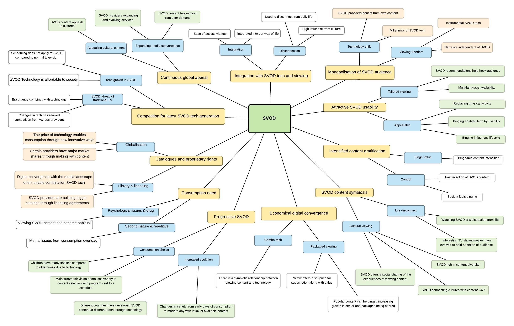

## Ph.D. Communications – Universitat Pompeu Fabra  

{ width="800" }  
*© James Glass 2025*

**Qualitative Analysis: Viewing, Consumption and Usability of SVOD.**

**Author:** James Glass  
**University:** Universitat Pompeu Fabra  
**Supervisor:** Dr. Manel Jiménez Morales  

### Abstract
This research examines Subscription Video On-Demand (SVOD) using Netflix as one of the main examples that has seen a dramatic increase in usage in recent years compared to the traditional way of viewing content through television. 
Using focus group sessions and an online survey, a qualitative analysis approach is used by way of a thematic analysis to elaborate and gain insight into the phenomenon of SVOD within our society which has allowed viewers to alter time shifting and self-scheduling habits. Watching online film and television over the internet, forces the breakdown of the traditional value chain of viewing methods as well as consumption of it. 
This research aims to narrow this research gap surrounding SVOD. The results will be used to add value to the research area of this growing and changing phenomenon of online TV consumption with SVOD. 

### 1. Introduction
SVOD has led the way for society to explore binge-watching programmes within the contemporary media landscape of SVOD online streaming. Increasingly people are choosing some online services such as Netflix for home viewing of watching movies and TV shows. Online video services are also very popular in society due to the advancement in technologies that are enabling audiences of all ages to access content.  

SVOD providers such as Netflix, in conjunction with the internet, have allowed the consumption of content on tablets or smartphones. This thesis investigates SVOD providers to highlight how the landscape has changed, how content is viewed, and by what new technological device.  

Building on these issues, we can further examine the points of change through the convergence of SVOD over the years, including:  
- Changes and continuities of sales by SVOD providers and distributors.  
- How these changes are affecting the type of content being produced.  
- Cultural and economic effects of streaming digital content.  

Additionally, market competition has grown as TV providers adopt new converged technologies, offering “triple play” packages with Video-On-Demand (Reardon 2006a, 2006b).  

---

### Introduction
SVOD has led the way for society to explore binge-watching programmes within the contemporary media landscape of SVOD online streaming. Increasingly people are choosing some online services such as Netflix for home viewing of watching movies and TV shows. Online video services are also very popular in within society due to the advancement in technologies that are enabling audiences of all ages to access content. SVOD providers such as Netflix along in conjunction with the internet has allowed the viewing consumption of content to be accessed via tablets or smartphones. This thesis investigation of SVOD provider will help highlight how the landscape has been changed and how content is viewed and by what new technological device. Building on such issues we can further examine the points of change through the convergence of SVOD over the years. These will include changes and continuities of sales by SVOD providers and distributors as they have adapted to the changing broadcasting landscape and global marketplace. Another area to consider is the how these changes are affecting the type of content being produced. Services like Netflix allow consumers to stream digital content that has an increased effect culturally and economically, further how there is an opportunity to innovate and respond to continual changes of media convergence and consumer requirements. Additionally, there has been growing market competition by TV providers due to the new convergence of technologies in that, they begun to offer “triple play” in partnership with Video-On-Demand (VOD) services, (Reardon 2006a, 2006b).

---

The convergence of television with internet technology has redefined our society along with the visual technology that has gone almost unchanged for many decades until recent years; television has become completely interactive, personalised and viewed on-demand. The idea for this study stems from:
- There is a gap in this field of research of online TV.
- The SVOD industry needs continuous analysis to measure its impact with society.
- The evolution of this technology has been so fast that continuous research is required.

The change of consumer habits and self-scheduling behaviours have impacted the way of producing television. The digital era has had an impact on television. The new technical developments have created new ways of watching television as well as creating new associated behaviours with these developments that have allowed the derestriction and consumption of television programmes to be viewed not on a static programme schedule via a classic TV set but rather whenever and wherever. The various device options and way to access content is easily available and ever increasing and changing, the content becomes more and more available everywhere and at any time as suggested by Einav and Carey (2009). Significant improvements in Internet speed, online media player capacities, and consumer comfort with Internet usage enabled significant maturation in the online video space. 

### 1.1 The birth of Netflix
As one of the best-known SVOD provider globally, Netflix was founded in California, USA, by a former high-school math teacher, Reed Hastings, and his former colleague, Marc Randolph, in 1997 (Auletta, 2014). The initial idea of renting and selling DVDs over the internet reportedly came to Hastings, when he received a $40 fine for returning an overdue videotape, the Apollo 13 (Funding Universe, n.d.). The initial strategy, which was based on a pair of emerging technologies (DVD and the Internet) and relied on the U.S. Postal Service, was a service, where the consumer could rent movies online and receive them with the post next day (Auletta, 2014). 

---

Netflix began its life in 1997, an era where industry experts knew that the DVD format was potentially to become the new way of viewing content, and the company positioned itself to exploit this imminent format. To fully understand how Netflix changed television viewing, it is important to understand that Netflix was not a broadcast, satellite, cable, or premium cable channel. It did not use (and still does not) a pre-set programming schedule that forces viewers to watch a certain show at a particular time and day. Netflix would eventually play an integral role in the pioneering of streaming online television content, Netflix prudently avoided the development of online video within the market but it would rather dabble in online video, Netflix utilised its website to build up its DVD rental system designed to help users find content they would enjoy while collecting proprietary consumer-preference data that would later become an essential part of its future. Towards the end of the 1990's Netflix was a home video rental distributor with a robust and user-friendly website. Over the next decade, Netflix became much more and introduced new ways via its adaptable innovative developments for viewers to consume television content. Netflix began enabling subscribers to stream TV shows and movies at the beginning of 2007. Netflix filled market categories that previous video start-ups were incapable of doing. 

---

Around the second half of the 2000´s, Internet technology rapidly developed, and devices could be connected to it that allowed television content to be viewed. Such Internet enabled devices such as the launch of the Xbox 360 in 2005, and the emergence of the iPhone in 2007 along with the Roku DVP set top box in 2008 and the iPad in 2010. Netflix, by the end of 2010 was available on all mentioned devices and gradually more. By 2012, Netflix became available on many different Internet devices which included smartphones, gaming consoles and along with tablets. Netflix, for example became a pioneer in the streaming of media and a leader in developing delivery capacities across a range of smart devices. Netflix along with the Internet has allowed the viewing consumption of content to be accessed via tablets or smartphones. The convergence of television with internet technology has redefined our society and a visual technology that has gone almost unchanged for many decades until recent years; television has become completely interactive, personalised and viewed on demand.

---

In the early days of before Netflix, watching television meant that the programming was predetermined by the provider and broadcasted on a pre-set schedule. Times have changed and these changes have been driven by consumer demands and the advent of the Internet. Newer trends began to emerge such as “Cutting-the-cord”, where consumers are cancelling their expensive traditional TV subscriptions and substituting them with cheaper substitutes or known as “Shaving-the-cord” whereby consumers are choosing cheaper TV packages as well as supplementing them with online video content. Turmoil ensued due to these newer trends in the “Over-The-Top” (OTT) market not to mention the widespread use of internet-enabled mobile devices. As the online video streaming market has gained a larger market share, it was commonly believed that traditional television was under threat is still dominates the market to date. Technological transformations have accelerated this shift or growth in the market in similar ways. For the first thirty years of the medium television watching was primarily controlled by networks, offering limited choice of programming on a tightly delimited schedule with no other options to access content, (Mittel, 2006, p. 31).

---

Netflix provided DVD and Blu-Ray rentals initially and later moved onto online streaming services. Customers can sign up for different subscription plans to provide thousands of movies and TV shows with unlimited access provided that they have internet-connected devices. Revenue is purely generated through subscription fees, since Netflix does not sell advertisement and therefore its content is ad-free. In 1999, a subscription system was launched that allowed customers to rent an unlimited number of DVDs, one at a time, for a low monthly subscription fee (Netflix). In 2000, the company had a very small subscriber-base and profits were very low, so Hastings then went to make a partnership with the video-rental giant, Blockbuster, and offered them to sell 49% of Netflix, but Blockbuster did not accept the deal (Auletta, 2014). However, Hastings did not give up. The company first became profitable in 2002 when it went public. The subscriber base and DVD titles were continuously growing throughout the years, when in 2007, management saw a new opportunity rising. Online streaming was added to the available services, which allowed subscribers to instantly watch video content on their web-enabled devices. According to Netflix (2016a) “viewers can watch as much as they want, anytime, anywhere, on nearly any Internet-connected screen. Members can play, pause and resume watching, all without commercials.” This illustrates that viewers of Netflix have the control about how much content they watch, when, where and in which way they want to use Netflix. This development indicates that with its changes the company aimed to improve its service for the customers and to adapt to technical innovations. When DVDs become popular as a medium for storing and distributing videos, the company followed (or better foresaw) this trend and integrated DVDs into its renting service. The same applies for its streaming feature that was introduced when broadband Internet became a standard for many people in the U.S. and Netflix realized a new opportunity for its service. Depending on the amount of watched content, streaming videos can be cheaper than buying a movie, especially as Netflix asks a monthly fee allowing unlimited streaming in return. Many viewers want to watch a movie and then move on without collecting it on DVD. Consuming video content is all about “watch it and forget it” (Dixon, 2013, p. 24).

---

Between 2007 and the end of 2009, the subscription base of Netflix increased with approximately 4,5 million members (Auletta, 2014). Having its ups and downs in the last few years, Netflix has become the leading streaming company around the world. It has entered the business of original programme production, has become the first internet TV-network winning the Primetime Emmy Award and has reached more than fifty million subscribers globally.

---

### 1.2 Television convergence
The popularity of television in the US began to gain popularity soon after the World War II. or early 1950s, when the sales of TV sets started to increase (Parsons, 2008) and from this programming started to expand from mainly broadcastings to original dramas. By the 1960´s Cable Television started to gain more interest, where most of the viewers received their television broadcasts through an antenna system called Community Antenna Television (CATV). During the 1980s and mid-1990s direct satellite television (DBS) soon took off and the number of cable networks significantly increased, viewing shows exploded and Videocassette recorders (VCRs) became widely available for the public (Stephens, 2000). By 1996, the saturation of the US television market reached 66.7 percent of American households and a with a growing revenue of approximately $25.7 billion (Parsons, 2008). 

---

With growing competition and Digital Broadcast Services (DBS) services starting to take away subscribers, the latter half of the 1990s offered new technological developments. One of those developments, the most important, was digitalisation, when for example cable operating companies started to upgrade their distribution networks from analogue to digital (Parsons, 2008). This technological development opened up the way to provide high-speed internet access, high definition and advanced digital video services, such as Video-On-Demand (VOD) and Subscription Video-On-Demand (SVOD).

---

Television services, during the 1980's and 1990's, were completely different than what we have been used to recently. Until VCRs became widely available and Video-On-Demand (VOD) was made possible, television broadcasting was based on a pre-set schedule whereby shows, movies and TV-series were scheduled to specific time-slots. This changed with the Video Home Systems (VHSs) that had gained more popularity and dominance during the 1990s. Video rental stores started to show up and grow into huge chains like Blockbuster and recording of TV programmes straight from the television became possible. Although VHS was still number one at the end of the 20th century, the new millennium brought some more important technological advancement.

*© James Glass 2025*
