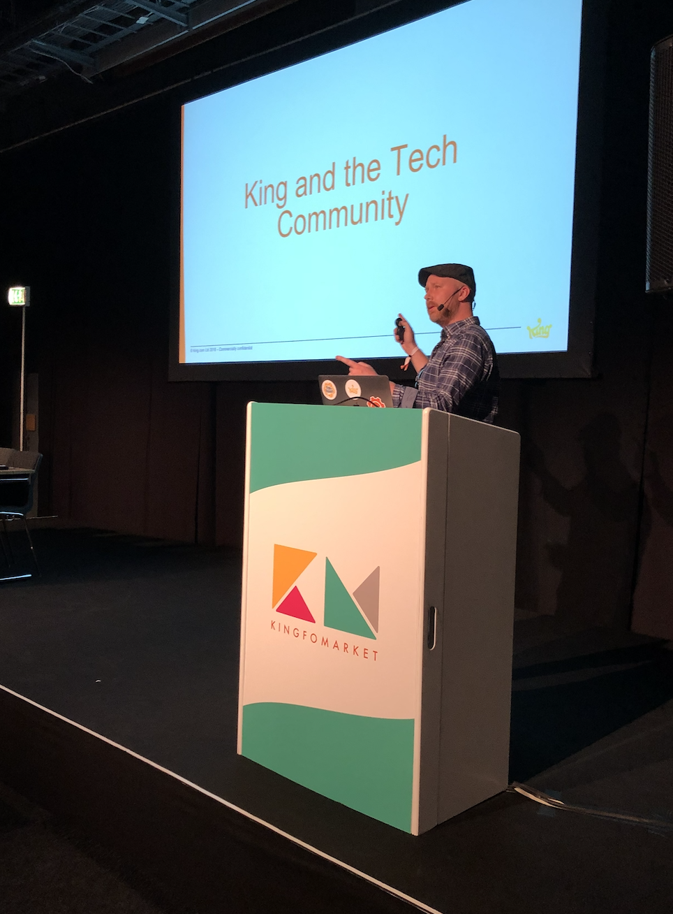

# Welcome to James Glass PhD

## About Me

**Senior Technical Writer | Developer Enablement & Systems Documentation**

I'm **James Glass, PhD**, a Senior Technical Writer specialising in complex systems, developer enablement, and data-driven documentation.

I work closely with engineering, product, and operational teams to make platforms, workflows, and tools clear, usable, and scalable—helping organisations deliver better digital products and experiences.

My work is centered around three pillars:

- **Technical Writing & Docs-as-Code** – Creating clear, scalable documentation using modern, automated workflows  
- **Developer Enablement** – Supporting developers and internal teams through effective documentation and tooling  
- **Knowledge Management & Strategy** – Designing documentation systems that scale with teams and products  

---

## Summary

Data-informed Senior Technical Writer and Documentation Manager with extensive experience documenting complex systems, workflows, and internal platforms.

Proven partner to Product, Engineering, and Design teams, delivering clear, structured documentation aligned with product development and operational needs. Experienced in documenting system behaviour, user workflows, and data-driven processes in high-scale environments.

Strong focus on using data to measure documentation effectiveness, including KPI tracking, user feedback analysis, and continuous content improvement.

Expertise in Docs-as-Code workflows, developer enablement, and emerging AI-assisted documentation practices.

---

### Key Skills

- **Technical Documentation & Information Architecture** – Structuring, authoring, and maintaining clear, user-focused documentation  
- **Systems & Workflow Documentation** – Documenting processes, integrations, and platform behaviour  
- **Docs-as-Code** – Markdown, Git/GitHub workflows, CI/CD pipelines  
- **Developer Enablement** – API and SDK documentation (working knowledge), OpenAPI/Swagger, internal tooling support  
- **Product & Project Collaboration** – Requirements gathering, sprint planning, roadmap alignment, stakeholder management  
- **Knowledge Management** – Content strategy, governance, and lifecycle management  
- **Data & Analytics** – Looker Studio, SQL (working knowledge), BigQuery, experimentation and KPI tracking  
- **Tools** – Jira, Confluence, Trello, Miro, Google Sheets, Jupyter  

---

## What Drives Me

I’m passionate about **simplifying complexity**—translating technical systems, workflows, and data into clear, usable documentation that supports both technical and non-technical users.

I’m particularly interested in how documentation supports **scalable digital platforms**, where clarity in systems, processes, and data flows directly impacts product quality and user experience.

I also have a growing focus on **AI and intelligent systems**, exploring how they can enhance documentation, improve discoverability, and support developer workflows.

---

## Beyond Work

{ width="350" }

Outside of work, I find balance and inspiration through creative and active pursuits:

- 📸 **Photography** – capturing moments and visual storytelling  
- 🥾 **Hiking** – exploring nature and disconnecting from screens  
- 🎬 **Film** – from documentaries to creative cinema  

I’m also interested in the intersection of **technology, media, and human behaviour**, and how innovations like AI are shaping how we create and share knowledge.

---

## Connect With Me
---
!!! note "Learn more"

    Visit my [LinkedIn](https://www.linkedin.com/in/james-glass-phd-206b7b3/)
    
    Visit my [WordPress](https://thewritingtimesblog.wordpress.com)
---